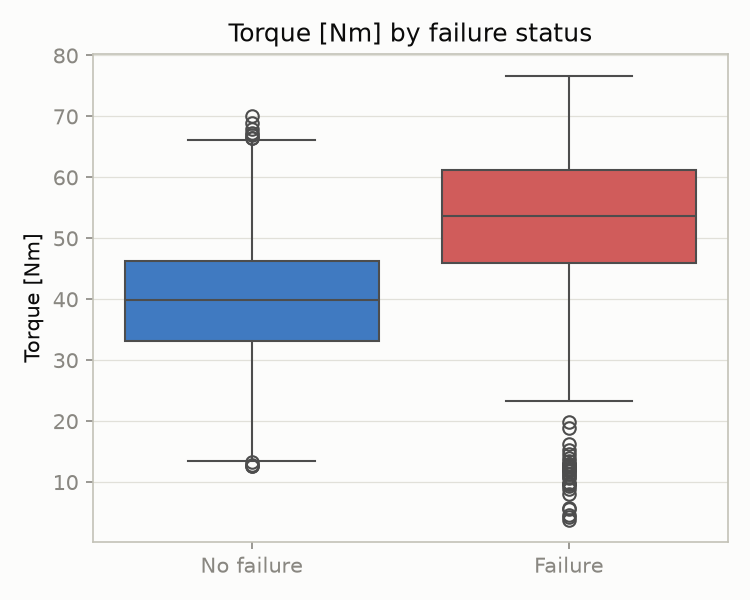
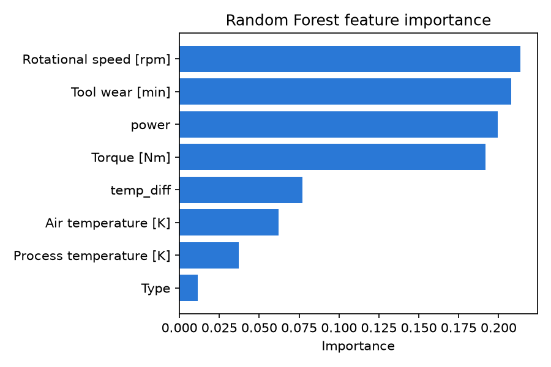

# ai-transition

A 16-week Data Analyst → AI engineering transition project.
Building toward a flagship **User Insight Copilot** (LLM classification + RAG + agent + deployment).

## Data

This project uses two datasets:

1. **Social media sentiment data** — the raw CSV and the cleaned output are both excluded via `.gitignore` (`data/*.csv`, `data/*.parquet`); run `src/load_feedback.py` to generate `data/feedback_clean.parquet` locally.
2. **AI4I 2020 Predictive Maintenance Dataset** — not included in the repo. Download it from [Kaggle](https://www.kaggle.com/datasets/stephanmatzka/predictive-maintenance-dataset-ai4i-2020) or the [UCI Machine Learning Repository](https://archive.ics.uci.edu/dataset/601/ai4i+2020+predictive+maintenance+dataset), and place the CSV at `data/machine_failure.csv`. See `src/inspect_machine_data.py` for an initial data-quality check.

## Project #0: Predictive Maintenance (AI4I 2020)

### Overview

A manufacturing failure-prediction workflow rebuilt with a modern sklearn
toolchain (`Pipeline`, `ColumnTransformer`, stratified cross-validation),
motivated by predictive-maintenance problems seen in real semiconductor
equipment manufacturing (ASM). The focus is not the model itself but the
workflow around it: a single train/test split and a headline accuracy
number are both misleading on this kind of data, and the project is built
to surface — and defend against — that.

### Data

[AI4I 2020 Predictive Maintenance Dataset](https://archive.ics.uci.edu/dataset/601/ai4i+2020+predictive+maintenance+dataset)
— 10,000 rows, 5 numeric sensor features (air temperature, process
temperature, rotational speed, torque, tool wear) plus a machine `Type`
tier (L/M/H). No missing values. Only **3.39%** of rows are labeled
`Machine failure = 1` — this class imbalance, not model choice, is the
central challenge of the project.

### Key Findings

- **A dummy baseline scores 96.6% accuracy with 0% recall.** A classifier
  that always predicts "no failure" gets a high headline number while
  missing every real failure — accuracy is not a usable metric on this
  data; precision/recall/F1 on the failure class are.
- **Univariate separation (Cohen's d) ranks Torque highest** (d = 1.08),
  clearly ahead of Tool wear (0.59), Air temperature (0.46), and Rotational
  speed (−0.24).
- **Random Forest feature importance ranks Rotational speed above
  Torque** — the opposite order from the univariate result. Torque and
  Rotational speed are strongly correlated (r = −0.88), so a model that can
  use both features jointly distributes the same signal differently than a
  test that looks at one feature at a time. Univariate and multivariate
  importance are answering different questions, and they can disagree.
- **A physically-motivated feature, `power = torque × rotational speed`,
  lands in the top 3** most important features — evidence that encoding
  domain knowledge (approximate mechanical load) adds signal beyond the
  two raw features it's built from.

### Method & Results

Preprocessing (`StandardScaler` on numeric features) is wrapped inside an
sklearn `Pipeline` together with the classifier, so scaling statistics are
always fit on training folds only — no leakage into validation or test
data. Logistic Regression and Random Forest (both `class_weight="balanced"`)
are compared with 5-fold `StratifiedKFold` cross-validation instead of a
single split, and the better pipeline is then evaluated once on a held-out
test set it never saw during model selection.

| Model | CV F1 (mean ± std) | Holdout F1 |
|---|---|---|
| Logistic Regression | 0.273 ± 0.019 | — |
| Random Forest | 0.812 ± 0.051 | **0.846** |

Random Forest wins clearly and consistently across folds (its worst fold,
0.73, still beats Logistic Regression's best fold, 0.31), and its holdout
performance (precision 0.887, recall 0.809, F1 0.846) is close to its CV
mean — evidence the result is stable rather than a lucky split.

### Visuals



Torque is the cleanest univariate signal in the data: the failure and
no-failure distributions barely overlap.



Multivariate importance reshuffles the univariate ranking once correlated
features (Torque, Rotational speed) and engineered features (`power`) are
all considered together.

### Repro

```bash
# 1. Download the dataset from Kaggle or UCI (see Data section above)
#    and place it at data/machine_failure.csv

# 2. Inspect the raw data (shape, missing values, class balance, consistency checks)
uv run src/inspect_machine_data.py

# 3. EDA + feature engineering -> data/machine_model_ready.parquet, figures/*.png
uv run src/eda_machine.py

# 4. Baseline comparison: Dummy vs Logistic Regression vs Random Forest
uv run src/train_baseline.py

# 5. Final pipeline: leak-safe preprocessing + 5-fold CV model selection
#    -> models/best_pipeline.joblib
uv run src/pipeline_model.py
```

## Week 1 — build a tiny LLM app while refreshing Python

**Status: complete ✅**

| Day | File | Goal |
|-----|------|------|
| Mon 7/7 | `src/hello.py` | Environment + first LLM call ✅ |
| Tue 7/8 | `src/load_feedback.py` | Load + clean a real feedback dataset ✅ |
| Wed 7/9 | `src/models.py` | Pydantic models for structured LLM output ✅ |
| Thu 7/10 | `src/llm_client.py` | Reusable LLM client (retry + cost logging) ✅ |
| Fri 7/11 | `src/pipeline_demo.py` | End-to-end: data → LLM → parsed model → print ✅ |

**What's in place:**

- **Environment**: `uv`-managed virtualenv, `.env` for the Anthropic API key, dependencies pinned in `pyproject.toml`.
- **Data cleaning**: `load_feedback.py` collapses a raw social-media sentiment dataset into 3-class labels (`positive` / `negative` / `neutral`) and writes `data/feedback_clean.parquet`.
- **Pydantic models**: `models.py` defines `FeedbackLabel`, `FeedbackBatch`, and `WeeklyInsight` for structured LLM output, with field-level validation (sentiment enum, confidence range) and cross-field validation (`FeedbackBatch.total` must match `len(items)`).
- **LLM client**: `llm_client.py` wraps the Anthropic SDK with exponential-backoff retries (rate limits, server errors, connection issues) and per-call cost logging, so callers don't have to reimplement retry logic.
- **End-to-end demo**: `pipeline_demo.py` samples 5 feedback rows, labels each with `call_llm`, validates the JSON reply against `FeedbackLabel`, skips and logs any row that fails validation instead of crashing, and assembles the successes into a `FeedbackBatch`.

## Setup (Day 1)

```bash
# 1. install uv (one-time)
curl -LsSf https://astral.sh/uv/install.sh | sh

# 2. install dependencies into a local .venv
uv sync

# 3. add your key
cp .env.example .env      # then paste your real key into .env

# 4. run the smoke test
uv run src/hello.py
```

Success = you see `✅ LLM replied:` followed by a sentence.

## Day 2 (Tue 7/8) — load + clean feedback data

```bash
uv run src/load_feedback.py
```

Reads `data/sentimentdataset.csv`, collapses the raw fine-grained emotion
labels into 3 classes (`positive` / `negative` / `neutral`), and writes the
cleaned dataset to `data/feedback_clean.parquet`.

Success = the script prints the raw shape, the cleaned shape, and the
3-class distribution, then reports `Saved -> data/feedback_clean.parquet`.

## Day 3 (Wed 7/9) — Pydantic models for structured LLM output

`src/models.py` has no script to run on its own — it defines the schemas
(`FeedbackLabel`, `FeedbackBatch`, `WeeklyInsight`) that every later script
imports. Exercise it directly with a quick check:

```bash
uv run python -c "
from src.models import FeedbackLabel
print(FeedbackLabel(sentiment='positive', topic='ui', confidence=0.9))
"
```

Success = a `FeedbackLabel(...)` instance prints back; passing an invalid
`sentiment` or a `confidence` outside `[0, 1]` raises a `ValidationError`.

## Day 4 (Thu 7/10) — reusable LLM client with retry

```bash
uv run src/try_structured.py
```

Pulls one row of real feedback, calls `call_llm` (from `src/llm_client.py`)
to label it, and parses the JSON reply into a `FeedbackLabel`.

Success = you see the feedback text, the raw LLM JSON, the parsed
`FeedbackLabel(...)`, and a `[llm_client] ... cost=$...` line showing token
usage and estimated cost.

## Day 5 (Fri 7/11) — end-to-end pipeline

```bash
uv run src/pipeline_demo.py
```

Samples 5 feedback rows (fixed `random_state` for reproducibility), labels
each one through `call_llm`, validates every reply against `FeedbackLabel`
(skipping and logging any row that fails validation instead of crashing),
and assembles the successes into a `FeedbackBatch`.

Success = a `--- Results ---` block listing each feedback preview with its
sentiment/topic/confidence, followed by a `Succeeded: N, Failed: M` summary.

## Week 2 — predictive maintenance dataset

**Status: in progress**

| Day | File | Goal |
|-----|------|------|
| Tue 7/8 | `src/inspect_machine_data.py` | Inspect the AI4I 2020 predictive maintenance dataset ✅ |
| Tue 7/8 | `src/eda_machine.py` | EDA (distribution plots, correlation heatmap, failure rate by Type) + feature engineering ✅ |
| Tue 7/8 | `src/train_baseline.py` | Baseline model comparison: Dummy vs Logistic Regression vs Random Forest ✅ |
| Wed 7/9 | `src/pipeline_model.py` | Refactor into sklearn Pipeline + 5-fold cross-validated model selection ✅ |

### Day 1 (Tue 7/8) — inspect the AI4I predictive maintenance dataset

```bash
uv run src/inspect_machine_data.py
```

Loads `data/machine_failure.csv` and prints
shape/dtypes, missing values, the `Machine failure` class balance,
consistency between the aggregate failure flag and the 5 individual
failure-mode flags, and numeric feature ranges.

Success = a report with all 5 sections prints cleanly. Key findings so far:
no missing values, but severe class imbalance (only ~3.4% of rows are
`Machine failure = 1`), and a small number of rows (~27) where the
aggregate flag disagrees with the individual failure-mode flags.

### Day 2 (Tue 7/8) — EDA + feature engineering

```bash
uv run src/eda_machine.py
```

For each of the 5 numeric sensor features, saves a boxplot comparing the
failure vs no-failure distributions to `figures/`, plus a correlation
heatmap over all numeric features and the target. Also prints the failure
rate broken down by machine `Type`, and ranks the 5 features by Cohen's d
(standardized mean difference between the failure and no-failure groups).
Then engineers two domain-driven features (`temp_diff` = process temp − air
temp; `power` = torque × rotational speed), ordinally encodes `Type`
(L=0/M=1/H=2), drops leaky/ID columns (`UDI`, `Product ID`, and the 5
individual failure-mode flags), and saves the result to
`data/machine_model_ready.parquet` (gitignored — generate it locally by
running the script).

Success = 6 PNGs appear under `figures/`, and the script ends with a
`Saved modeling-ready data (10000 rows, 9 cols) -> data/machine_model_ready.parquet`
line.

**Analysis results:**

- **Failure rate by Type**: L = 3.92%, M = 2.77%, H = 2.09% — lower-tier
  machines fail more often than higher-tier ones.
- **Feature separation (Cohen's d, failure vs no-failure), ranked**:
  Torque (1.077) > Tool wear (0.586) > Air temperature (0.458) >
  Rotational speed (−0.244) > Process temperature (0.199).
  **Torque is by far the most discriminative single feature** — its
  boxplot shows almost no overlap between the two groups (median ~40 Nm for
  no-failure vs ~53 Nm for failure), consistent with high torque signaling
  an overload condition.
- **Correlated feature pairs**: Air/Process temperature (r = 0.88) and
  Rotational speed/Torque (r = −0.88) are both strongly correlated —
  this is the motivation for the two engineered features: `temp_diff`
  captures the *relative* temperature gap (a proxy for abnormal cooling)
  instead of two redundant absolute temperatures, and `power` combines
  torque and speed into a single proxy for mechanical load instead of two
  features that mostly move in opposite directions.

### Day 3 (Tue 7/8) — baseline model comparison

```bash
uv run src/train_baseline.py
```

Stratified 80/20 train/test split (`random_state=42`) on
`data/machine_model_ready.parquet`. Trains and evaluates three models on
the held-out test set: a `DummyClassifier` that always predicts "no
failure" (the control group), `LogisticRegression(class_weight="balanced")`
with `StandardScaler`, and `RandomForestClassifier(class_weight="balanced")`
without scaling. Reports accuracy/precision/recall/F1 (failure class) and
the confusion matrix for each, and saves a Random Forest feature-importance
bar chart to `figures/feature_importance.png`.

Success = all three models' metrics print, plus
`Saved feature importance plot -> figures/feature_importance.png`.

**Analysis results:**

| Model | accuracy | precision | recall | F1 |
|---|---|---|---|---|
| Dummy (always "no failure") | 96.60% | 0.00% | 0.00% | 0.00% |
| Logistic Regression | 85.75% | 17.61% | 86.76% | 29.28% |
| Random Forest | 98.90% | 89.66% | 76.47% | 82.54% |

- The **Dummy baseline exposes the accuracy trap**: doing nothing useful
  still scores 96.6% accuracy on this imbalanced dataset, while missing
  every single real failure (precision/recall/F1 all 0). Accuracy alone is
  not a usable metric here.
- **Logistic Regression** catches most failures (recall 86.76%) but at the
  cost of many false alarms (precision only 17.61%) — `class_weight="balanced"`
  pushes it toward "flag anything suspicious."
- **Random Forest wins on every metric** (F1 = 0.8254): it can model
  non-linear interactions between features (e.g. torque × speed) that the
  linear Logistic Regression cannot, and is more robust to the strong
  correlations between features noted in Day 2.
- Random Forest's feature importance ranking (Rotational speed > Tool wear
  > `power` > Torque > `temp_diff` > ...) differs from Day 2's Cohen's d
  ranking (Torque was the top single feature) — Cohen's d measures each
  feature's standalone separation, while feature importance reflects
  multivariate interactions the tree model actually exploits.

### Day 4 (Wed 7/9) — sklearn Pipeline + cross-validated model selection

```bash
uv run src/pipeline_model.py
```

Refactors Day 3's ad-hoc scaling into a proper `ColumnTransformer` +
`Pipeline` (numeric features through `StandardScaler`, the already
ordinal-encoded `Type` column passed through unscaled), so preprocessing is
refit on training folds only — no leakage into validation/test data. Compares
Logistic Regression vs Random Forest with 5-fold `StratifiedKFold`
cross-validation (mean ± std F1 on the failure class) instead of a single
train/test split, picks the better pipeline, refits it on the full training
set, evaluates once on the held-out test set, and saves the fitted pipeline
with `joblib` to `models/best_pipeline.joblib` (gitignored — regenerate
locally by running the script).

Success = CV scores print for both pipelines, followed by the selected
model's held-out test metrics and a
`Saved fitted pipeline (...) -> models/best_pipeline.joblib` line.

**Analysis results:**

- **5-fold CV F1 (failure class)**: Logistic Regression mean = 0.2734
  (std = 0.0187) vs Random Forest mean = 0.8120 (std = 0.0507) — Random
  Forest wins clearly and consistently across folds, not just on one lucky
  split.
- **Random Forest selected**; final held-out test evaluation:
  precision = 0.8871, recall = 0.8088, F1 = 0.8462 — close to, and slightly
  better than, Day 3's single-split numbers, confirming the model's
  performance is stable rather than an artifact of one particular split.
- Random Forest's higher CV standard deviation (0.0507 vs 0.0187) says its
  score varies more fold-to-fold, but its *worst* fold (0.73) still beats
  Logistic Regression's *best* fold (0.31) — so the higher mean is a real,
  reliable advantage, not noise.
